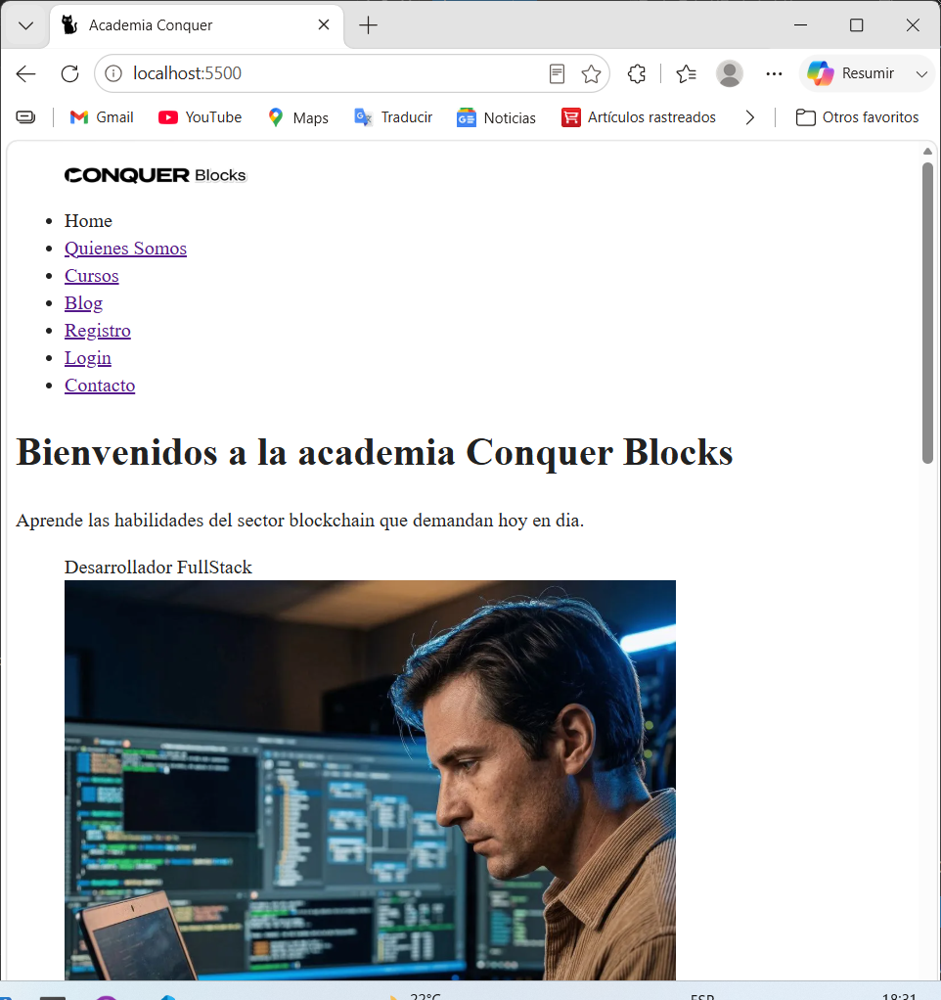

# Plataforma de Cursos Online con HTML- Full Stack Development

## Descripción

Este proyecto consiste en el desarrollo de una página web enfocada en la visualización de cursos online relacionados con el aprendizaje de Desarrollo Full Stack. Fue creada como parte de un proyecto académico con el objetivo de aplicar conocimientos en HTML.

## Objetivo del Proyecto

El propósito de esta página web es simular una plataforma educativa donde los usuarios puedan explorar cursos orientados al aprendizaje de tecnologías utilizadas en el desarrollo Full Stack, usando HTML.

## Funcionalidades

- Presentación de cursos disponibles  
- Organización estructurada del contenido web  
- Secciones informativas sobre aprendizaje en Desarrollo Full Stack  
- Navegación simple e intuitiva dentro de la página 
  

## Lo que aprendí

A través de este proyecto pude reforzar conceptos fundamentales relacionados con la estructura de documentos HTML, organización de contenido dentro de una página web y buenas prácticas al momento de desarrollar proyectos orientados a la web.

## Captura del Proyecto

 

## Autor

Proyecto desarrollado como parte de mi proceso de aprendizaje en desarrollo web y construcción de bases para convertirme en Full Stack Developer.